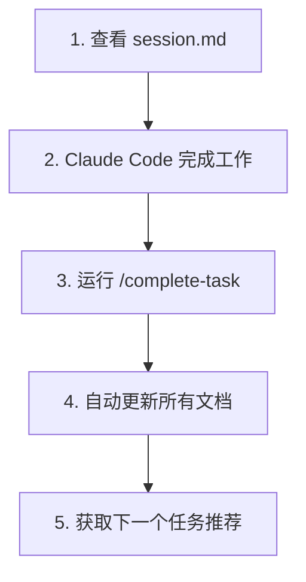

# 任务完成工作流程

## 问题：工作完成后文档没有自动更新

**场景**：
1. session.md 中记录了当前任务计划
2. Claude Code 按照计划完成工作（新增/修改文件）
3. 工作完成后，文档没有自动同步更新

**原因**：
Hook 只能检测文件操作，无法判断"任务是否完成"。需要用户主动标记任务完成。

---

## 解决方案：使用 `/complete-task` 命令

### 工作流程



### 详细步骤

#### 步骤 1: 查看当前任务

```bash
# 查看 session.md 了解当前任务
cat docs/session.md
```

输出示例：
```markdown
## 🎯 当前任务

| 任务ID | 描述 | 状态 | 负责模块 | 优先级 |
|--------|------|------|----------|--------|
| task-001 | 实现用户登录功能 | 🔄 进行中 | backend | P0 |
```

#### 步骤 2: Claude Code 完成工作

```bash
# 让 Claude Code 工作
# 例如：实现登录 API、创建数据模型等
```

#### 步骤 3: 标记任务完成

```bash
# 方式 1: 使用当前任务（推荐）
/complete-task

# 方式 2: 指定任务ID
/complete-task task-001

# 方式 3: 指定文件路径
/complete-task task-001-user-login.md
```

#### 步骤 4: 自动更新文档

命令会自动执行以下操作：

✅ **移动任务卡片**: `docs/todo/backlog/task-001-*.md` → `docs/done/2026-02/`
✅ **更新 session.md**: 清空"当前任务"，添加到"上一个任务"
✅ **更新 current-sprint.md**: 将任务状态改为 ✅ 完成
✅ **更新 archive-index.md**: 添加归档记录
✅ **推荐下一个任务**: 调用 task-suggester agent

#### 步骤 5: 查看推荐

命令会自动调用 task-suggester agent，推荐下一个任务：

```markdown
## 🎯 建议的下一个任务

### 推荐 1: task-002 - 设计用户数据模型
- **理由**: 依赖任务 task-001 已完成，现在可以开始
- **优先级**: P0
- **预计时间**: 2-3 小时
- **依赖任务**: ✅ task-001: 实现用户登录功能
```

---

## 命令参数详解

### 格式 1: 不提供参数（推荐）

```bash
/complete-task
```

**行为**：
- 自动从 `session.md` 读取"当前任务"
- 最常用的方式

**适用场景**：
- session.md 中记录了当前任务
- 一次只做一个任务

### 格式 2: 任务ID

```bash
/complete-task task-001
```

**行为**：
- 自动查找对应的任务文件
- 支持 3 位任务ID 格式

**适用场景**：
- 同时做了多个任务
- session.md 未及时更新

### 格式 3: 文件路径

```bash
# 完整路径
/complete-task docs/todo/backlog/task-001-user-login.md

# 文件名
/complete-task task-001-user-login.md
```

**行为**：
- 使用指定的文件路径

**适用场景**：
- 任务文件名不规范
- 需要精确指定文件

---

## 实际使用示例

### 示例 1: 完成单个任务

```bash
# 1. 开始工作
"请按照 session.md 中的任务，实现用户登录功能"

# [Claude Code 完成工作...]

# 2. 标记完成
/complete-task

# 输出：
# ✅ 任务已归档: docs/done/2026-02/task-001-user-login.md
# ✅ 已更新 session.md
# ✅ 已更新 current-sprint.md
# ✅ 已更新 archive-index.md
#
# [推荐下一个任务...]
```

### 示例 2: 完成多个任务

```bash
# 1. 一次完成了多个任务
"请完成以下任务：
- task-001: 用户登录
- task-002: 用户注册
- task-003: 密码重置"

# [Claude Code 完成工作...]

# 2. 分别标记完成
/complete-task task-001
/complete-task task-002
/complete-task task-003

# 或者不提供参数，按顺序完成
/complete-task  # 完成 task-001
/complete-task  # 完成 task-002（如果 session.md 已更新）
```

### 示例 3: 任务文件不在 backlog/ 目录

```bash
# 如果任务文件在其他位置，使用完整路径
/complete-task docs/somewhere/task-001-feature.md

# 或者先移动到 backlog/
mv docs/somewhere/task-001-feature.md docs/todo/backlog/
/complete-task task-001
```

---

## 与 Hook 的配合

### 自动检测 vs 手动标记

| 方式 | 触发条件 | 优点 | 缺点 |
|------|---------|------|------|
| **PostToolWrite Hook** | 使用 `mv` 命令移动文件 | 完全自动 | 需要手动移动文件 |
| **complete-task 命令** | 运行命令 | 方便快捷 | 需要手动运行 |

### 推荐工作流程

```bash
# 方式 1: 使用命令（推荐）
/complete-task  # 自动处理所有文档更新

# 方式 2: 使用 mv 命令（高级用户）
mv docs/todo/backlog/task-001.md docs/done/2026-02/
# Hook 会自动检测并更新文档

# 两种方式效果相同！
```

---

## 故障排查

### 问题 1: 命令未找到

```bash
/complete-task
# 输出：Command not found: /complete-task
```

**原因**: 插件未正确加载

**解决**:
```bash
# 检查插件目录
ls ~/.claude/plugins/claude-task-pilot/commands/

# 应该看到 complete-task.md
```

### 问题 2: 未找到当前任务

```markdown
❌ 未找到当前任务

session.md 中没有记录当前任务。

请提供任务ID或文件路径，例如:
- /complete-task task-001
- /complete-task task-001-feature.md
```

**解决**:
```bash
# 方式 1: 手动提供任务ID
/complete-task task-001

# 方式 2: 更新 session.md
vim docs/session.md
# 添加当前任务到"## 🎯 当前任务"部分
```

### 问题 3: 任务文件不存在

```markdown
❌ 任务文件不存在

路径: docs/todo/backlog/task-001-unknown.md
```

**解决**:
```bash
# 1. 检查任务是否已归档
ls docs/done/ | grep task-001

# 2. 检查当前任务列表
cat docs/todo/current-sprint.md | grep task-001

# 3. 搜索任务文件
find docs -name "task-001*.md"
```

### 问题 4: 部分文档更新失败

```markdown
⚠️ 部分文档更新失败

任务已归档，但以下文档更新失败:
- docs/session.md: Permission denied
```

**解决**:
```bash
# 1. 检查文件权限
ls -la docs/session.md

# 2. 手动更新文档
vim docs/session.md

# 3. 检查磁盘空间
df -h
```

---

## 最佳实践

### 1. 工作完成后立即标记

```bash
# ✅ 好的做法
"实现用户登录"
[完成工作]
/complete-task

# ❌ 不好的做法
"实现用户登录"
[完成工作]
[继续做其他事情...]
[忘记标记完成]
```

### 2. 定期检查文档同步

```bash
# 每天开始工作前，检查文档是否最新
cat docs/session.md
cat docs/todo/current-sprint.md
```

### 3. 使用版本控制

```bash
# 提交完成的任务和文档更新
git add docs/
git commit -m "Complete task-001: User login feature"
```

### 4. 保持任务卡片更新

```bash
# 如果任务范围变化，先更新任务卡片
vim docs/todo/backlog/task-001.md
# 添加 "## ✅ 完成内容" 部分
# 记录实际完成的工作
```

---

## 总结

**核心工作流程**：
1. 查看 `session.md` 了解当前任务
2. Claude Code 完成工作
3. 运行 `/complete-task` 标记完成
4. 查看推荐，开始下一个任务

**关键要点**：
- ✅ 使用 `/complete-task` 命令标记任务完成
- ✅ 命令会自动更新所有相关文档
- ✅ 自动推荐下一个任务
- ✅ 保持文档与实际工作同步

**相关命令**：
- `/complete-task` - 标记任务完成（本命令）
- `/convert-design-to-tasks` - 将设计文档转换为任务卡片
- `/setup-task-pilot` - 初始化项目结构
